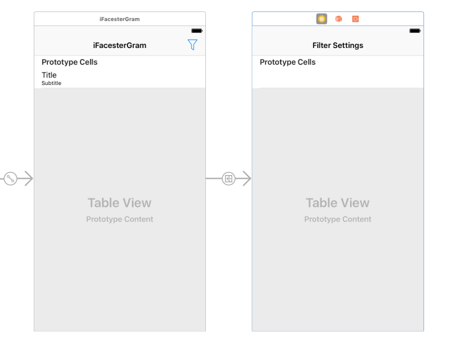

# AC3.2-APIs: Part II 
### Detailing, Managing and Storing Requests
---
### Readings

1. [HTTP Methods - tutorialspoint](https://www.tutorialspoint.com/http/http_methods.htm)
2. [What is the difference between POST and GET? - Stackoverflow](http://stackoverflow.com/questions/3477333/what-is-the-difference-between-post-and-get)
3. [Understanding HTTP Basics - OneMonth](http://learn.onemonth.com/understanding-http-basics)

#### References

1. [HTTP Header Fields - tutorialspoint](https://www.tutorialspoint.com/http/http_header_fields.htm)
  - Note: this is to have for reference, there's much more info here than you need right now
2. [HTTP Status Codes - REST API Tutorial](http://www.restapitutorial.com/httpstatuscodes.html)
3. [HTTP Methods for RESTful Services - REST API Tutorial](http://www.restapitutorial.com/lessons/httpmethods.html)
4. [What is REST? - REST API Tutorial](http://www.restapitutorial.com/lessons/whatisrest.html)

---
### Parameterization of Requests

We've already taken a look at how to refine the data that gets returned from an API: the RandomUserAPI allows for parameters to be passed in with the URL to determine the information that is sent in a response. For example, we can limit the number of returned results by tacking on the key `results` with an integer as the value. Looking at the RandomUserAPI documentation, we can see there are a number of these parameter keys we can use to craft the response data as we need to:

|`Key`|Purpose|Example|
|---|---|---|
|`results`| Determines the number of users that are returned | https://randomuser.me/api/?results=10 |
|`gender`| Determines if male/females should be returned | https://randomuser.me/api/?gender=female |
|`nat`| Determines which nationalities should be returned | https://randomuser.me/api/?nat=US,BR,GB |

---
### A "Settings" Menu

By allowing ourselves to modify our request to the RandomUserAPI by use of parameters, we can flexibily change our data set displayed in the tableview. But currently, we have to change our code and re-run our app every time we want to make a change to the data being displayed. This is a less-than-ideal situation, so let's remedy it by creating a settings menu that will allow us to adjust the data that gets displayed in our table. 

For this particular settings menu, we want to be able to change the following:

1. The number of results per request (from 1 - 5000)
2. The gender of the returned Users (Male, Female or Both)
3. The pool of nationality that the Users can be from (there are many of these)

Q1: What `UIControl` could best fit each menu option?

There are different possible answers, but for our purposes a <code>UISlider, UISegmentedControl, and multiple UISwitch</code> (respectively) would satisfy what we need to accomplish. 

Q2: If we have a prototype cell with a control element in it, how do we detect which cell the element was changed in?

You'll need a few things (such as a way to index to keep track of the contents of each cell), but more importantly to detect events for a prototype cell that is going to appear multiple times, we'll need to subclass <code>UITableViewCell</code> and have it handle the event. 

#### Storyboard Updates, Part 1

Part of being a developer is being able to "read" an image and convert it to code (or storyboard, in this case). Take a look at the following image and think about how to recreate it in your own storyboard without looking at the provided hints (down below). 

Q1: What can we say for certain about the changes needed?

<ol>
  <li> A new table view controller is needed
  <li> There is one custom prototype cell in it
  <li> The view controller's title is "Filter Settings"
  <li> There is a new push segue from the UserTableViewController (how do we know this?)
  <li> There is a new bar button item on the navigation bar
 </ol>

Q2: Similarly, what is ambiguous about the changes?

<ol>
  <li> The purpose of the new button
  <li> The source of the image of the new button
  <li> The source for the segue (is it tapping the cell? is it the new button?)
  <li> The class of the tableviewcontroller (is it UITableViewController, or some subclass?)
</ol>

__Implementation Details (a.k.a "spoilers")__

1. Create a new `UITableViewController` subclass called `SettingsTableViewController`, assign it to the class of  `UITableViewController` you added to the storyboard
2. The image for the `UIBarButtonItem` is in your `Assets.xcassets` folder
3. The segue source is the new `UIBarButtonItem` (no other configuration is needed)

#### Storyboard Updates: Part 2

The above example was, for the most part, straightforward. This one will be a bit trickier:

__Discuss:__

Q1: What can we say for certain about the changes needed?

Q2: Similarly, what is ambiguous about the changes?

__Implementation Details (a.k.a "spoilers")__

1. Change the `UITableView` to have 3 prototype cells with identifiers and a height of `60pt`:
  1. `SliderCell`
  2. `SegmentedControlCell`
  3. `SwitchCell`
2. `SliderCell` Details
  - The cell is comprised of 3 elements: 2 `UILabel`s and a `UISlider`
  - All elements are vertically aligned in their container
  - `# of Results` label
     1. `8pt` to left/right, relative to margins
     2. `height` of `21pt`
  - `9999` label
     1. `8pt` left/right
     2. `width` of `65pt`, `height` of `21pt`
  - Slider
     1. `height` of `30pt`
     2. `8pt` to left/right, relative to margins
3. `SegmentedControlCell` Details
  - 1 `UILabel` and `UISegmentedControl` with three options: `Both, Male, Female`
  - All vertically aligned in container, and `8pt` left/right constraints relative to margins
  - There is a space of `16pt` between the `Gender` label and the segmented control
  - The segemented control has a `height` of `24pt`
4. `SwitchCellDetails`
  - 1 `UILabel` and 1 `UISwitch`
  - Again, both elements are vertically aligned
  - `Option` label is `8pt` to left relative to margins
  - Switch is `8pt` to the right, relative to margins. Additionally, it is `height`: `31pt`, `width`: `49pt` 

